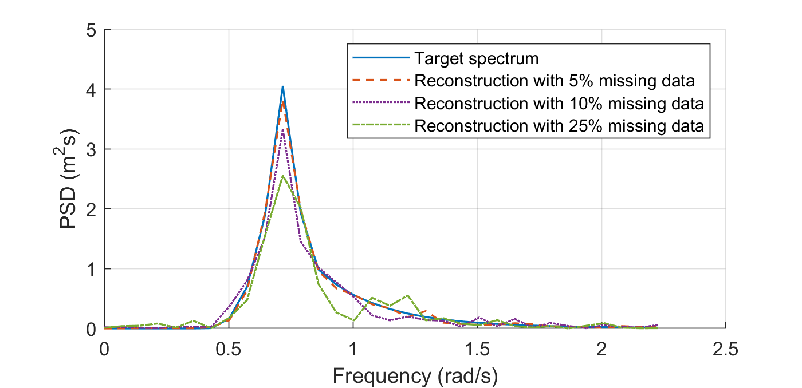
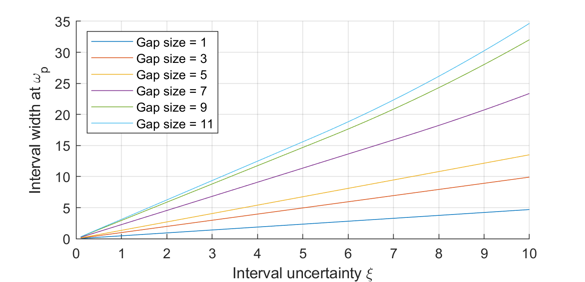
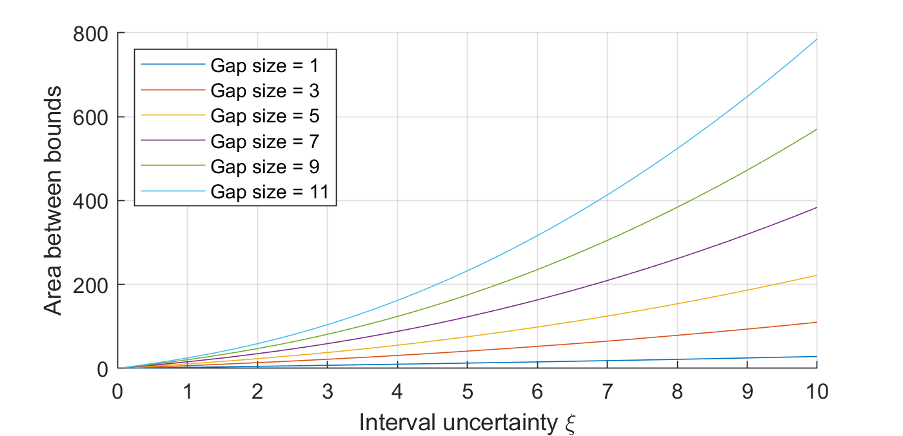
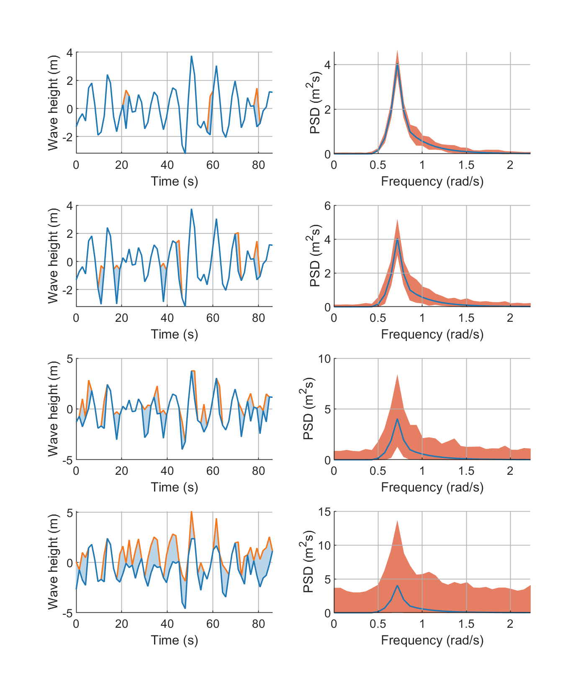
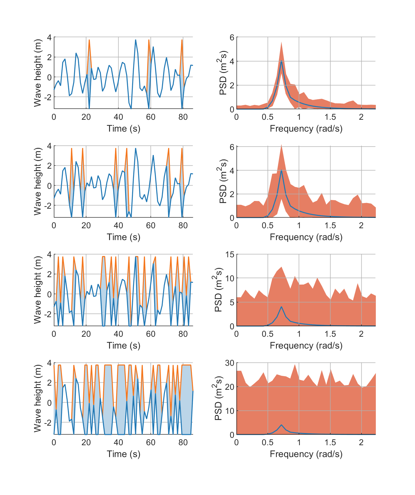
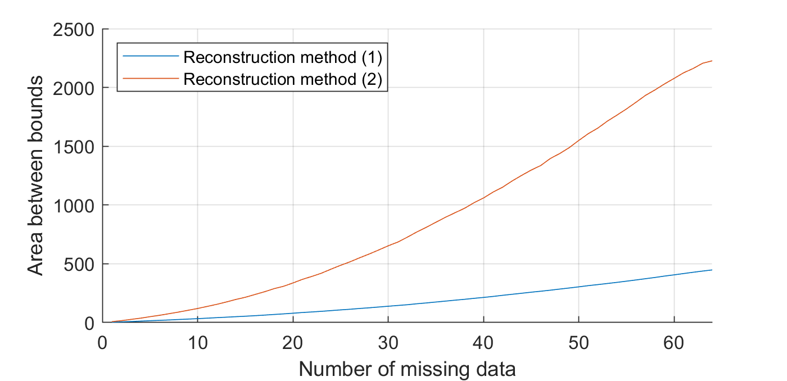
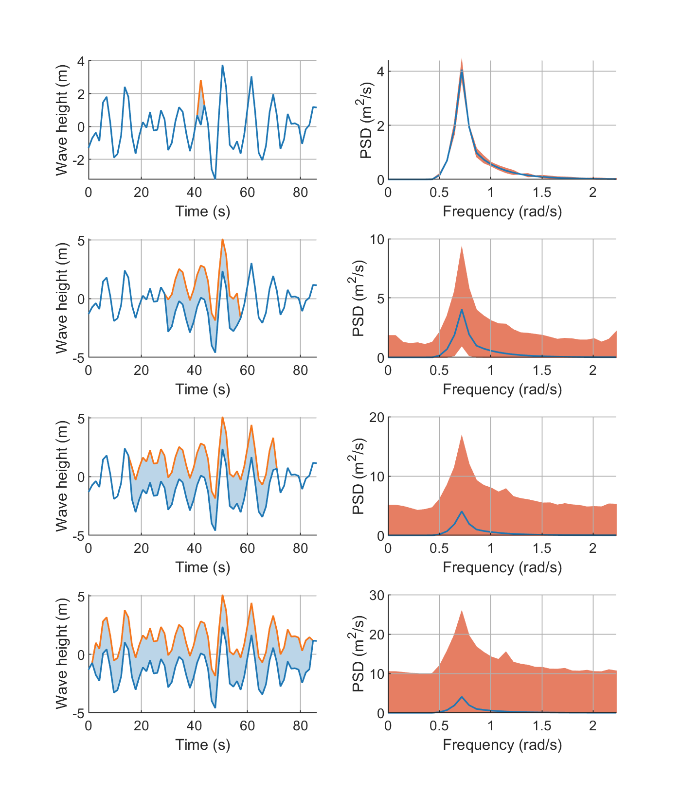
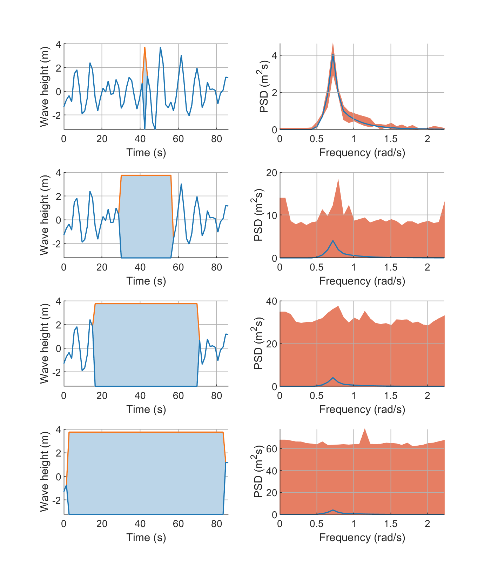
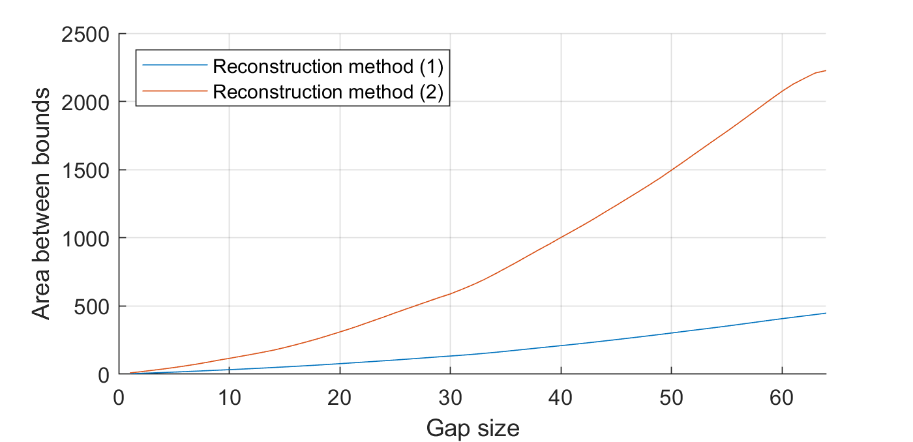
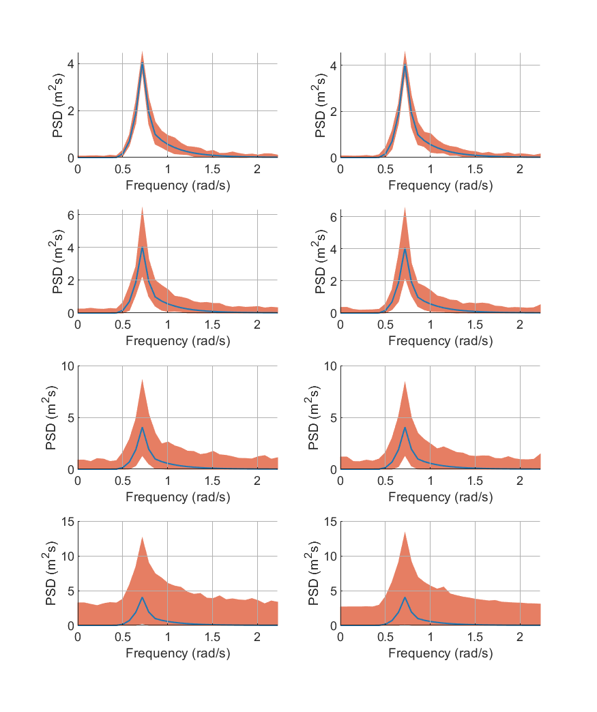

# Application of the interval DFT algorithm to missing data problems
In this respository, the influence of missing data on the interval DFT algorithm is investigated, in particular the sensitivity to interval uncertainty, the number of missing data, the gap size of missing data and the distribution of missing data within the signal are studied. The interval DFT algorithm is described in details in [Behrendt et al. (2022)](https://doi.org/10.1016/j.ymssp.2022.108920) and [De Angelis et al. (2021)](https://arxiv.org/abs/2012.09778). For an elaboration of the algorithm from a more mathematical point of view, see [de Angelis (2022)](https://arxiv.org/abs/2205.13978). 

### Sensitivity of the DFT to perturbed data
The file `DFT_sensitivity.m` is available to investigate the sensitivity of the interval DFT algorithm with respect to the interval uncertainty. In fact, the DFT is sensitive to small changes in the signal. To demonstrate the sensitivity, a signal consisting of 64 data points, is investigated. The target spectrum, i.e. the Fourier amplitude of the signal without missing data, is depicted with the Fourier amplitudes of the same signal with 5\%, 10\% and 25\% missing data, which are reconstructed by linear interpolation between the two adjacent non-missing data points.

### Sensitivity to interval uncertainty
With `influence_sensitivity.m` the influence of the missing data to the interval DFT algorithm is investigated. To do so, the signal is randomly equipped with missing data gaps of length $l_g \in \{1,3,5,7,9,11\}$, where the gap length is given as the number of missing time points. The interval uncertainty $\xi$ of these gaps is successively increased from $0.1$ to $10$. To determine the sensitivity, the interval width of the Fourier amplitude at the peak frequency $\omega_p$, as well as the area between the upper and lower bounds are determined.

### Number of missing data
The influence of the number of missing data can be investigated with `influence_number_missing_data.m`. The interval uncertainty has been kept constant and corresponds to the sample standard deviation of the signal and the minimum and maximum of the entire signal. These reconstruction methods are referred to in the following as reconstruction method (1) and reconstruction method (2). The number of missing data points, on the other hand, has been gradually increased to investigate the influence of the number of missing data on the bounds of the power spectrum. The reconstructed signals and the the bounds of the estimated PSDs are shown for 5\%, 10\%, 25\% and 50\% missing data in the signal.

The results for reconstruction method (1) are given in this figure.

The results for reconstruction method (2) are given in this figure.

The area between the bounds for both reconstruction methods for increasing number of missing data is given below.

### Gap size of missing data
Utilising `influence_gap_size.m` will display the results for the investigation of the gap size of missing data. To determine the influence of the gap size, different scenarios were evaluated. The gap size $l_g \in \{1,20,40,60\}$ were artificially inserted into the signal. The gaps were first reconstructed with method (1) and then with method (2). The signals and the corresponding transformations are shown below.

Results for reconstruction method (1): 

Results for reconstruction method (2): 

Results for the area between the bounds:

### Distribution of missing data
Running `influence_distribution.m` will start an investigation of the influence of the distribution of the missing data within the signal. For the sake of brevity, only the results for reconstruction method (1) are shown. For the investigations a uniform distribution and a binomial distribution were utilised to randomly generate the missing data and to investigate their influence on the transformation to the frequency domain. The interval PSDs of the reconstructed signal with 4, 8, 16 and 32 missing data are depicted in the following.

Results for reconstruction method (1): 

## References
**Behrendt, M.; de Angelis, M.; Comerford, L.; Zhang, Y,; Beer, M. (2022):** Projecting interval uncertainty through the discrete Fourier transform: an application to time signals with poor precision, Mechanical Systems and Signal Processing, 172, Article 108920, DOI: [10.1016/j.ymssp.2022.108920](https://doi.org/10.1016/j.ymssp.2022.108920).

**De Angelis, M.; Behrendt, M.; Comerford, L.; Zhang, Y.; Beer, M. (2021):** Forward interval propagation through the discrete Fourier transform, The 9th international workshop on Reliable Engineering Computing, [arXiv:2012.09778](https://arxiv.org/abs/2012.09778).

**de Angelis, M. (2022):** Exact bounds on the amplitude and phase of the interval discrete Fourier transform in polynomial time, arXiv, DOI:  [10.48550/arxiv.2205.13978](https://doi.org/10.48550/arxiv.2205.13978).

